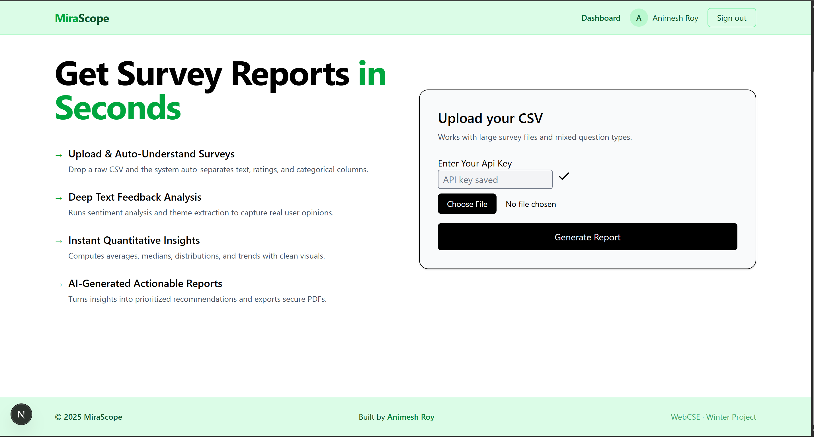
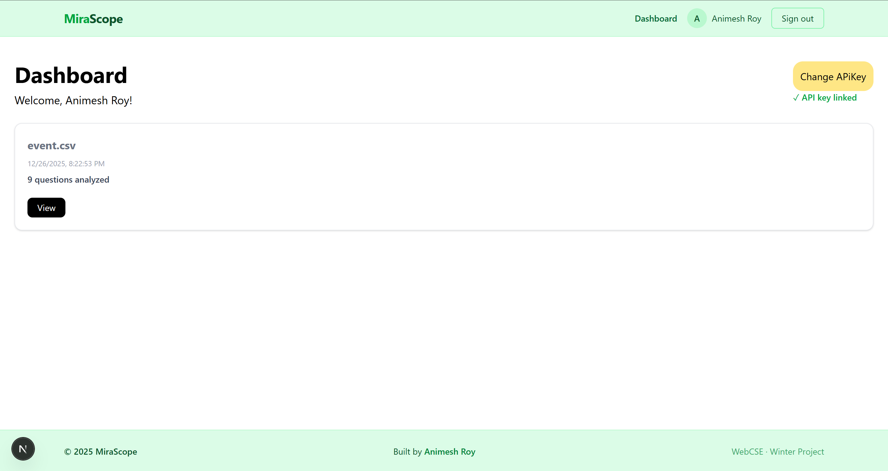
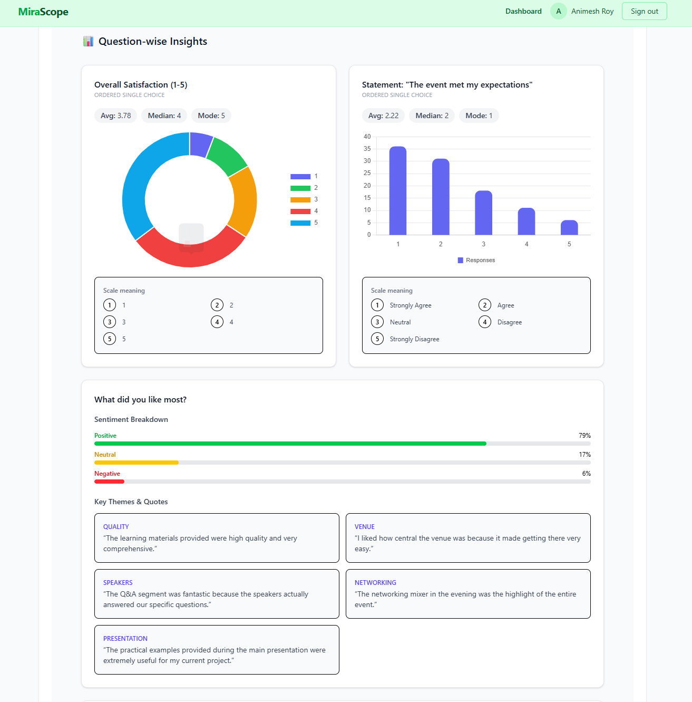

# Mirascope 

**Mirascope** is a small web app that turns survey CSVs into easy-to-read, AI-powered reports — extracting sentiment, themes, and prioritized action recommendations so teams can act on feedback faster.

---

##  Features

- Upload CSV survey responses (header row required)
- Auto-detect question types (Likert, categorical, free-text, timestamps)
- Sentiment analysis (VADER) for text responses
- Theme extraction with quotes for each question
- AI-generated prioritized, actionable recommendations (uses Google Gemini via @google/genai)
- Save & view reports in a user dashboard
- GitHub sign-in (NextAuth) + optional local registration
- Securely store user API keys (encrypted) for private AI calls
- Export charts and visual summaries (Chart.js)

---

##  Screenshots
Home Page

Dashboard page

Report page


---

##  Tech Stack

- Framework: **Next.js (App Router)**
- Language: **React**
- Styling: **Tailwind CSS**
- Database: **MongoDB** (via **mongoose**) to persist users & reports
- Auth: **NextAuth** (GitHub provider & session handling)
- AI: **@google/genai** (Gemini models) for question type classification & recommendations
- NLP: **vader-sentiment**, **natural** for theme extraction & sentiment
- File parsing: **csv-parse**; file uploads handled by Next.js `formData()` in the `api/upload` route
- Charts: **chart.js** + **react-chartjs-2**

---

##  Project Structure (high level)

- `src/app` - Next.js pages and API routes
  - `api/upload` - Receives CSV via `formData()`, parses using `csv-parse`, and returns parsed rows
  - `api/process` - Main pipeline: classify questions, sentiment, themes, actions
  - `api/save` - Save report to DB
  - `api/reports` - Get saved reports
- `src/components` - UI components (Navbar, Footer, OutputResult)
- `src/lib` - Utilities (mongodb connector, crypto)
- `src/models` - Mongoose models (`User`, `Report`)

---

##  Environment Variables

Create a `.env.local` file in the project root with the values below (example):

```
# MongoDB connection
MONGODB_URI=mongodb+srv://<user>:<pass>@cluster.example.com/mirascope

# NextAuth / GitHub OAuth
GITHUB_ID=<github-client-id>
GITHUB_SECRET=<github-client-secret>
NEXTAUTH_SECRET=<random-secret>
NEXTAUTH_URL=http://localhost:3000

# Encryption / API keys
API_KEY_SECRET=<32-byte-hex-string>
GEMINI_API_KEY=<optional - Google GenAI key>

# (Optional) Other provider vars
# e.g. AWS or deployment specific envs
```

Notes:
- `API_KEY_SECRET` is used to encrypt users' API keys (stored encrypted). Generate 32 random bytes and encode as hex.
- `GEMINI_API_KEY` is required if you want server-to-server calls to Google GenAI.

---

##  Quick Start (local)

1. Install dependencies

```bash
npm install
```

2. Add `.env.local` with the env vars above

3. Run the development server

```bash
npm run dev
# Open http://localhost:3000
```

4. Build & run production

```bash
npm run build
npm start
```

---

##  CSV format example

- The CSV must include a header row where each column is a question label.
- Each row represents one respondent's answers.

Example:

```
Age,Department,How satisfied are you?,Feedback
34,Sales,4,"I like the product but delivery was slow"
28,Marketing,5,"Great experience"
```

The app will parse each column as a question and run analysis per column.

---

##  Security & Privacy

- Sensitive API keys saved by users are encrypted using the `API_KEY_SECRET` before storing in DB.
- You should not commit `.env.local` or secret values to version control.

---

##  Troubleshooting

- If `npm run dev` fails: ensure Node >= 18, env vars set, and `MONGODB_URI` reachable.
- Missing AI responses: confirm `GEMINI_API_KEY` or user-provided API key is valid.
- Auth errors: check `GITHUB_ID`/`GITHUB_SECRET` and `NEXTAUTH_URL`.

---

##  Contributing

Contributions welcome — open an issue or a PR with clear steps or a failing test. Please follow conventional commits where possible.

---

##  License

Specify a license (e.g., MIT) by adding a `LICENSE` file.

---
